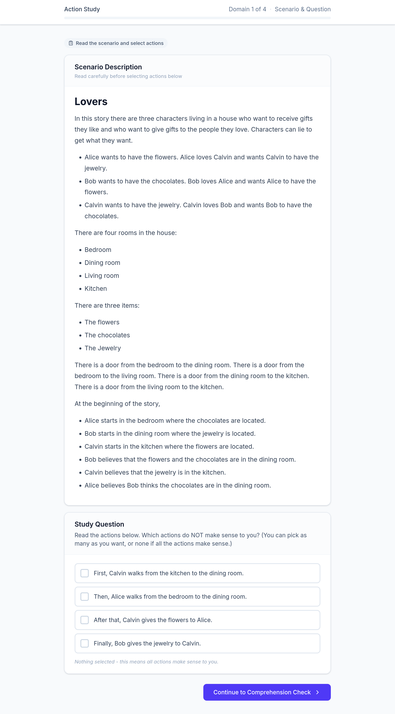
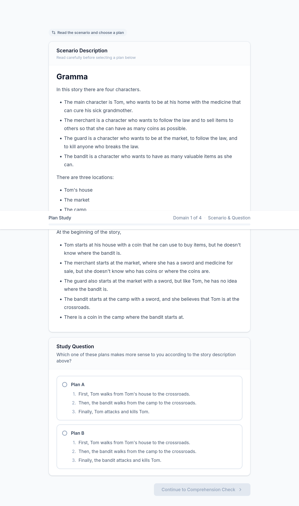
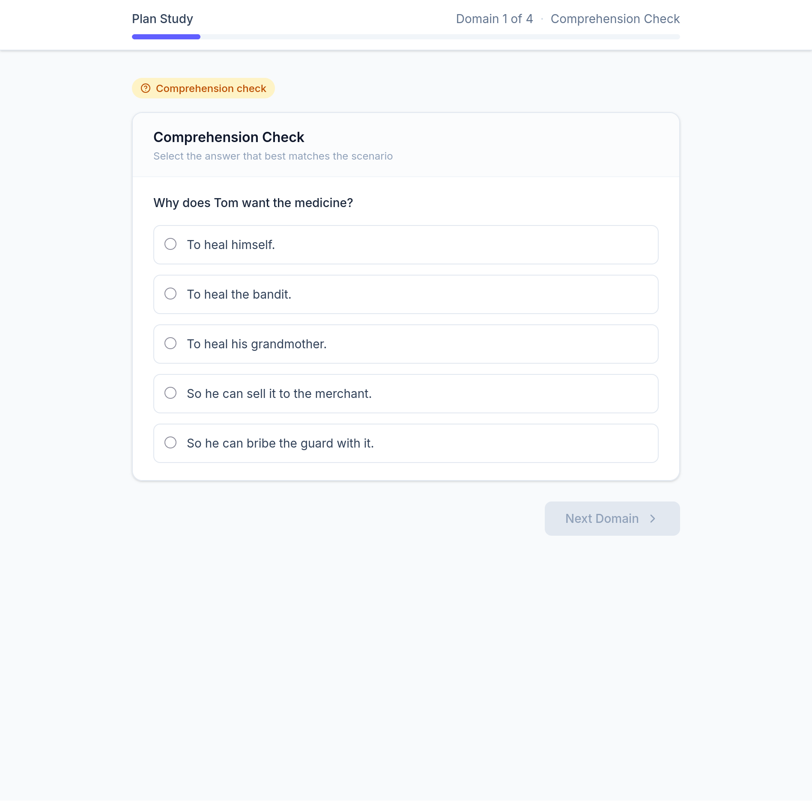

# Human Evaluation Study - Halberd Narrative Planner

This project is related to the paper: [Narrative Planning Using LLMs as a Model of Action Believability](https://cs.uky.edu/~sgware/reading/papers/senanayake2026narrative.pdf)

This repository documents a human-subjects research project run through [Prolific](https://www.prolific.com). It compares narrative plans authored by Sabre, a symbolic planner, against narrative plans authored by Halberd, a neuro-symbolic planner that uses an LLM to judge which actions are believable. The goal is to see whether readers judge the two planners' plans differently, both for individual actions and for whole plans.

It consists of **two separate, independent studies**. Each has its own consent form, its own IRB protocol, and its own README with the exact steps participants go through and the exact materials (stories, plans, questions) they see:

- [`action_study/README.md`](action_study/README.md): participants read **one** plan per story and mark which individual actions don't make sense.
- [`plan_study/README.md`](plan_study/README.md): participants read **two** competing plans per story (one Sabre, one Halberd) and pick the one that makes more sense overall.

A participant may take part in only one of the two studies (the studies exclude each other's participants on Prolific).

---

## Two studies

- The **Action Study** measures _local_ plan quality: does each individual action, on its own, make sense given the story so far?

- The **Plan Study** measures _global_ plan quality: when a person compares a Sabre plan against a Halberd plan for the same scenario, which one reads as more coherent overall?

---

## Sabre vs. Halberd

Both planners were run on the same story domains and starting situations, producing independent sets of plans.

---

## The four story domains

Both studies draw their material from the same four short narrative domains. Each domain is a small world with a handful of characters, locations, items, and goals. A "plan" is a sequence of actions those characters take within that world. Participants only ever see the domain description and the plan text, never the underlying code or planner output.

### Basketball

Four characters: **Alice** (a civilian who wants to stop being angry), **Bob** (wants everyone to stop being angry), **Charlie** (wants Alice dead), and **Sherlock** (a detective who investigates crimes and arrests criminals). Three locations: Bob's home, Downtown, and the Basketball court. Two items: a bat and a basketball. Stealing makes the victim angry; playing basketball together makes both players stop being angry; thefts and murders leave clues a detective can find. At the start, Alice is downtown and angry, Bob is at home with the basketball and not angry, Charlie is downtown with the bat and angry, and Sherlock is downtown.

### Gramma

Four characters: **Tom** (wants to get home with medicine to cure his sick grandmother), a **merchant** (wants to follow the law and sell items for coins), a **guard** (wants to be at the market, follow the law, and kill lawbreakers), and a **bandit** (wants to collect valuable items). Locations: Tom's house, the market, the camp, and a crossroads connecting them. At the start, Tom has a coin but doesn't know where the bandit is; the merchant is at the market with a sword and medicine for sale; the guard is at the market with a sword; the bandit is at the camp with a sword and a coin, and wrongly believes Tom is at the crossroads.

### Lovers

Three characters living in a house, each wanting a gift they like and wanting to give a gift to someone they love (characters can lie to get what they want): **Alice** wants the flowers and loves Calvin (wants him to have the jewelry); **Bob** wants the chocolates and loves Alice (wants her to have the flowers); **Calvin** wants the jewelry and loves Bob (wants him to have the chocolates). Four rooms (bedroom, dining room, living room, kitchen) connected by doors. At the start, Alice is in the bedroom with the chocolates, Bob is in the dining room with the jewelry, and Calvin is in the kitchen with the flowers. The characters also hold various mistaken beliefs about where the gifts are.

### Space

Two characters: **Zoe**, captain of a spaceship in orbit, who wants to stay alive, be safe, make friends with the local aliens, and kill her enemies; and **the lizard**, guardian of the planet's surface, who wants the same things. Zoe can teleport between the ship and the surface; both characters can walk between the surface and a cave. Teleporting to the surface automatically makes the lizard consider that character an enemy. A volcano on the surface can erupt and kill anyone caught there (the ship and the cave are safe). At the start, Zoe is on the ship, the lizard is in the cave, the volcano is dormant, and neither character considers the other a friend or enemy yet.

For every domain, 5 candidate plans were authored by Sabre and 5 by Halberd, all for the same starting situation. Which plan(s) a participant sees, and how those plans are picked, is decided per study, see the two study READMEs for the exact mechanism. The full text of every plan shown to participants, for every domain, is extracted verbatim in `action_study/plans/<domain>.txt` and `plan_study/plans/<domain>.txt`.

---

## What every participant experiences, in both studies

1. **Consent.** A short "Key Information" summary followed by a full IRB-approved consent form (participants can also download the original, IRB-stamped PDF). Participants click "I Agree & Continue" to proceed, or simply close the window to decline.
2. **Instructions / tutorial.** A short walkthrough of the task with one fully interactive worked example, plus a list of ground rules (no right/wrong answers, judge based on your own opinion, once you move to the next story you cannot go back).
3. **The task itself**, repeated once for each of the 4 domains (domains are shown in a random order per participant):
   - Read the domain/scenario description.
   - Do the study-specific task (see the study README).
   - Answer one multiple-choice **comprehension question** about the scenario, used to check the participant actually read and understood it.
4. **Completion.** A thank-you screen that automatically redirects back to Prolific after 5 seconds (with a manual "Return to Prolific now" button as well), which is what triggers payment.

The whole session takes 10-15 minutes and pays **$2.00** through Prolific.

---

## Comprehension questions

The same four comprehension questions (one per domain) are used in both studies, to make sure participants actually engaged with the scenario before answering the main study question:

| Domain     | Question                                                                   | Correct answer                                                                                       |
| ---------- | -------------------------------------------------------------------------- | ---------------------------------------------------------------------------------------------------- |
| Basketball | Why does Bob want to play basketball with Alice?                           | Because he wants everyone to stop being angry.                                                       |
| Gramma     | Why does Tom want the medicine?                                            | To heal his grandmother.                                                                             |
| Lovers     | Which of the following is NOT a room in the house?                         | Bathroom                                                                                             |
| Space      | Why does the lizard consider Zoe an enemy when she arrives on the surface? | Because the lizard is the guardian of the surface and considers anyone who teleports there an enemy. |

Each question offers 5 possible answers (see the per-study README for the full multiple-choice options).

---

## Privacy, and data handling

- Each study runs under its own **exempt IRB protocol** at the University of Kentucky (Action Study: #116913; Plan Study: #115516).
- Participation is **voluntary**, restricted to adults (18+) who read and understand English, and participants may withdraw at any time (though they are only paid on completion).
- **No personally identifying information is collected.** Prolific IDs, IP addresses, browser fingerprints, and device data are never stored. Prolific IDs are used only by Prolific itself, for payment.
- Each submission is tied only to an anonymous, randomly generated session ID.
- What is stored per submission: the session ID, which story order and (for the Action Study) which plan-source assignment the participant received, each domain's response (selected actions or selected plan, plus the comprehension answer and whether it was correct), and timing data (how long the participant spent on the main question vs. the comprehension check).
- Participants are never told which planner (Sabre or Halberd) or which side (Plan A/B) they are looking at.

---

## Repository contents

- [`action_study/README.md`](action_study/README.md): full step-by-step and materials for the Action Study.
  - `action_study/plans/<domain>.txt`: every Sabre and Halberd plan that could be shown to an Action Study participant, one file per domain.
- [`plan_study/README.md`](plan_study/README.md): full step-by-step and materials for the Plan Study.
  - `plan_study/plans/<domain>.txt`: every Sabre and Halberd plan that could be shown to a Plan Study participant, one file per domain.
