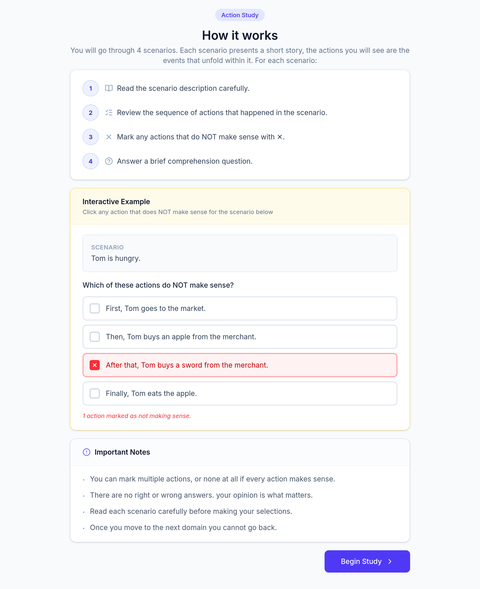

# Action Study - Narrative Action Evaluation

**IRB Protocol # 116913 (Exempt)**

This study asks participants to read a short narrative scenario together with a single sequence of actions (a "plan"), and to mark **which individual actions, if any, don't make sense** in the context of that scenario. The plan they see for each scenario was authored either by the purely symbolic narrative planner **Sabre** or by **Halberd**, a neuro-symbolic planner that uses an LLM to judge which actions are believable. The study measures whether people flag more nonsensical actions in one planner's plans than the other's.

---

## Step-by-step: what a participant does

**Step 1: Consent (about 2 min).** After opening the study link from Prolific, the participant sees the Participant Agreement screen: a "Key Information" summary of the study, followed by the full detailed consent text (check below). They can download the original IRB-stamped consent PDF. Clicking **"I Agree & Continue"** moves them forward; closing the browser window declines.

**Step 2: Instructions (about 1 min).** A short "How it works" tutorial explains the task in four steps, with one fully interactive worked example the participant can click through before starting for real:

1. Read the scenario description carefully.
2. Review the sequence of actions that happened in the scenario.
3. Mark any actions that do **NOT** make sense with X.
4. Answer a brief comprehension question.

Ground rules shown on this screen: participants may mark multiple actions, one action, or none at all; there are no right or wrong answers, it's their own judgment; read each scenario carefully; and **once they move to the next domain they cannot go back**.

**Step 3: the task (about 10 min), repeated once per domain.** Domains are presented in a random order. For each of the 4 domains (Basketball, Gramma, Lovers, Space, see the main [`README.md`](../README.md) for full domain descriptions):

- The domain description is shown.
- A single plan (a numbered list of actions written in plain English, e.g. *"First, Bob travels from Bob's house to the basketball court."*) is shown beneath the question *"Read the actions below. Which actions do NOT make sense to you? (You can pick as many as you want, or none if all the actions make sense.)"*
- The participant clicks any action(s) they consider nonsensical; clicking again deselects. Selecting nothing means "all actions make sense."
- They then click through to a **comprehension check**: one multiple-choice question about the scenario (see table below), which must be answered to proceed.
- Clicking "Next Domain" (or "Complete Study" on the last one) locks in that domain's answers. There is no way back to a previous domain.

**Step 4: Completion (about 1 min).** A thank-you screen confirms responses were recorded and auto-redirects to Prolific after 5 seconds (or immediately via a "Return to Prolific now" button), which triggers payment.

---

## How the plan a participant sees is chosen

Participants never choose or see which planner authored their plan, and are never told. The assignment is designed so that, across the whole participant pool, every plan gets shown to roughly the same number of people:

1. **Planner assignment (once per participant):** each participant is assigned, round-robin, to see either **only Sabre plans** or **only Halberd plans** for the entire session. Alternating participants get alternating planners, giving a perfectly even 50/50 split regardless of how many people take part.
2. **Plan selection (once per domain):** within their assigned planner, each domain draws its next plan round-robin from that domain's pool of 5 pre-generated plans from that planner (wrapping back to the first plan once the pool is used up), so every individual plan is shown an even number of times.

This means any two participants assigned to the same planner will, in total, see the same *pool* of plans across the study, just possibly in a different order. No participant ever compares a Sabre plan to a Halberd plan directly.

---

## Materials: every plan participants could see

Each domain has 5 pre-generated candidate plans from Sabre and 5 from Halberd. A given participant sees exactly one of these per domain, not the whole pool. The full, verbatim text of every plan is extracted in this folder, one file per domain:

- [`plans/basketball.txt`](plans/basketball.txt)
- [`plans/gramma.txt`](plans/gramma.txt)
- [`plans/lovers.txt`](plans/lovers.txt)
- [`plans/space.txt`](plans/space.txt)

---

## Comprehension questions

One per domain, asked after the action-marking step for that domain (correct answer in **bold**):

**Basketball**: Why does Bob want to play basketball with Alice?
- Because he wants to steal the basketball from her.
- Because he wants to arrest Alice.
- Because he is in love with Alice.
- **Because he wants everyone to stop being angry.**
- Because he wants to help Charlie.

**Gramma**: Why does Tom want the medicine?
- To heal himself.
- To heal the bandit.
- **To heal his grandmother.**
- So he can sell it to the merchant.
- So he can bribe the guard with it.

**Lovers**: Which of the following is NOT a room in the house?
- Bedroom
- Dining Room
- Living room
- Kitchen
- **Bathroom**

**Space**: Why does the lizard consider Zoe an enemy when she arrives on the surface?
- Because Zoe attacked the lizard.
- Because Zoe stole from the lizard.
- **Because the lizard is the guardian of the surface and considers anyone who teleports there an enemy.**
- Because the lizard wants to own the spaceship.
- Because the volcano made the lizard angry.

Comprehension answers may be used to flag low-quality/inattentive responses, alongside response-time data.

## Data recorded per submission

No Prolific ID, IP address, or device/browser fingerprint is ever recorded. Each submission stores:

- An anonymous, randomly generated session ID.
- The participant's assigned planner for the session (`llm` for Halberd, or `sabre`, never shown to the participant).
- For each of the 4 domains: which specific plan (configuration + plan ID) was shown, the plan text itself, the actions the participant marked as not making sense, the comprehension question answer and whether it was correct, and timing (time spent on the action-marking step, time spent on the comprehension check, and total time for that domain).
- Overall study start/end time and total duration.
