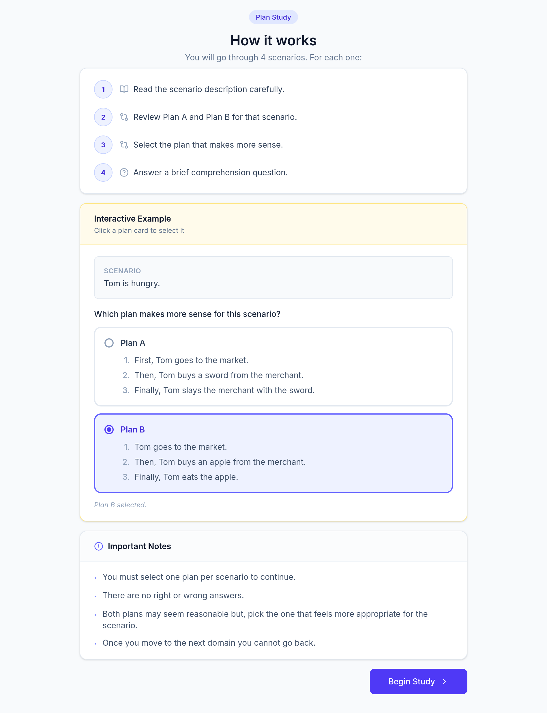

# Plan Study - Narrative Plan Evaluation

**IRB Protocol # 115516 (Exempt)**

This study asks participants to read a short narrative scenario together with **two competing plans** for how the story could unfold, labeled "Plan A" and "Plan B", and to pick **whichever plan makes more sense overall**. One plan in every pair was authored by the purely symbolic narrative planner **Sabre** and the other by **Halberd**, a neuro-symbolic planner that uses an LLM to judge which actions are believable. Which side (A or B) holds which planner's plan is randomized. The study measures which planner's plans people find more coherent, on the same scenario.

---

## Step-by-step: what a participant does

**Step 1: Consent (about 2 min).** After opening the study link from Prolific, the participant sees the Participant Agreement screen: a "Key Information" summary followed by the full detailed consent text (reproduced below), with a link to download the original IRB-stamped consent PDF. Clicking **"I Agree & Continue"** moves them forward; closing the browser window declines.

**Step 2: Instructions (about 1 min).** A short "How it works" tutorial explains the task in four steps, with one fully interactive worked example (two example plan cards the participant can click to select before starting for real):

1. Read the scenario description carefully.
2. Review Plan A and Plan B for that scenario.
3. Select the plan that makes more sense.
4. Answer a brief comprehension question.

Ground rules shown on this screen: participants must select one plan per scenario to continue; there are no right or wrong answers; both plans may seem reasonable, so pick whichever feels more appropriate; and **once they move to the next domain they cannot go back**.

**Step 3: the task (about 8-10 min), repeated once per domain.** Domains are presented in a random order. For each of the 4 domains (Basketball, Gramma, Lovers, Space, see the main [`README.md`](../README.md) for full domain descriptions):

- The domain description is shown.
- Two plan cards, **Plan A** and **Plan B**, are shown side by side, each a numbered list of actions in plain English, under the question *"Which one of these plans makes more sense to you according to the story description above?"*
- The participant clicks a card to select it (only one may be selected); the "Next" action is disabled until a plan is chosen.
- They then click through to a **comprehension check**: one multiple-choice question about the scenario (see table below), which must be answered to proceed.
- Confirming locks in that domain's answer. There is no way back to a previous domain.

**Step 4: Completion (about 1 min).** A thank-you screen confirms responses were recorded and auto-redirects to Prolific after 5 seconds (or immediately via a "Return to Prolific now" button), which triggers payment.

---

## How the two plans a participant sees are chosen

Participants are never told which side (A/B) is Sabre's plan and which is Halberd's plan, and the assignment is independent and random for every participant and every domain (there are no persistent counterbalancing groups to keep even, any sample size works):

1. For the domain, a **configuration** is picked at random from among those with both Sabre and Halberd plans available.
2. A **Sabre plan and a Halberd plan are randomly paired** from that configuration, excluding any pairing where the two plans are textually identical (so a participant is never asked to pick between two copies of the same text).
3. Which physical side, **Plan A or Plan B**, shows the Sabre plan vs. the Halberd plan is decided by an independent 50/50 coin flip.

So every comparison a participant makes is a genuine Sabre-vs-Halberd pairing for the same underlying scenario, but the position (A or B) carries no information about which planner produced it.

---

## Materials: every plan participants could see

Each domain has 5 pre-generated candidate plans from Sabre and 5 from Halberd, and a participant's actual A/B pairing is drawn randomly from that pool (excluding identical-text pairs). The full, verbatim text of every plan is extracted in this folder, one file per domain:

- [`plans/basketball.txt`](plans/basketball.txt)
- [`plans/gramma.txt`](plans/gramma.txt)
- [`plans/lovers.txt`](plans/lovers.txt)
- [`plans/space.txt`](plans/space.txt)

---

## Comprehension questions

One per domain, asked after the plan-comparison step for that domain (correct answer in **bold**):

**Basketball**: Why does Bob want to play basketball with Alice?
- Because he wants to steal the basketball from her.
- Because he wants to arrest Alice.
- Because he is in love with Alice.
- **Because he wants everyone to stop being angry.**
- Because he wants to help Charlie.

**Gramma**: Why does Tom want the medicine?
- To heal himself.
- To heal the bandit.
- **To heal his grandmother.**
- So he can sell it to the merchant.
- So he can bribe the guard with it.

**Lovers**: Which of the following is NOT a room in the house?
- Bedroom
- Dining Room
- Living room
- Kitchen
- **Bathroom**

**Space**: Why does the lizard consider Zoe an enemy when she arrives on the surface?
- Because Zoe attacked the lizard.
- Because Zoe stole from the lizard.
- **Because the lizard is the guardian of the surface and considers anyone who teleports there an enemy.**
- Because the lizard wants to own the spaceship.
- Because the volcano made the lizard angry.

Comprehension answers may be used to flag low-quality/inattentive responses, alongside response-time data.

## Data recorded per submission

No Prolific ID, IP address, or device/browser fingerprint is ever recorded. Each submission stores:

- An anonymous, randomly generated session ID.
- For each of the 4 domains: the configuration the pair was drawn from, both plans' text and IDs, which planner (`llm` for Halberd, or `sabre`) each of Plan A and Plan B actually was, which one the participant picked and which planner that corresponds to, the comprehension question answer and whether it was correct, and timing (time spent choosing between the plans, time spent on the comprehension check, and total time for that domain).
- Overall study start/end time and total duration.
